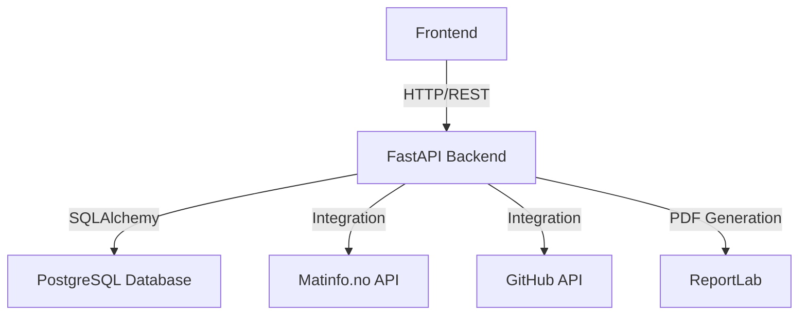
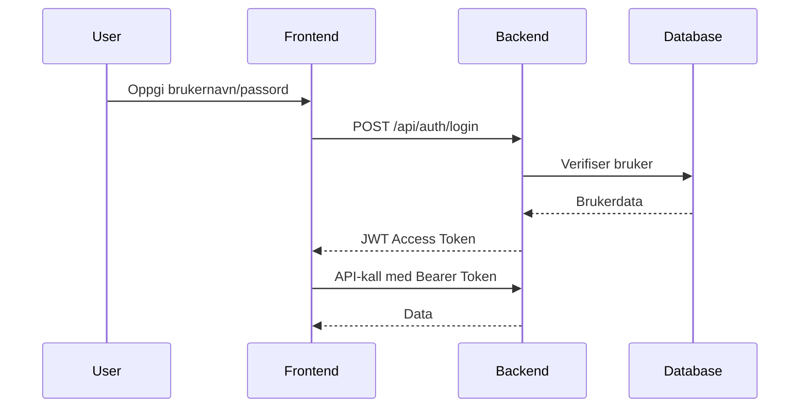

# API Dokumentasjon

Dette dokumentet beskriver hovedelementene i LKC Backend API.

## Oversikt

LKC Backend er et FastAPI-basert REST API for catering-systemet til Larvik Kommune. APIet håndterer produkter, kunder, ordrer, menyer og rapporter.

## Arkitektur

## Hovedmoduler

### 1. Produkthåndtering
- **Endpoint**: `/api/produkter`
- **Beskrivelse**: Administrere produktkatalog med priser, lager og kategorier
- **Modeller**: `Produkter` (tblprodukter)

### 2. Kundehåndtering
- **Endpoint**: `/api/kunder`
- **Beskrivelse**: Håndtere kundeinformasjon og kundegrupper
- **Modeller**: `Kunder` (tblkunder), `KundeGruppe` (tblkundegruppe)

### 3. Ordrehåndtering
- **Endpoint**: `/api/ordrer`
- **Beskrivelse**: Opprette og administrere ordrer
- **Modeller**: `Ordrer` (tblordrer), `OrdreDetaljer` (tblordredetaljer)

### 4. Menysystem
- **Endpoint**: `/api/meny`, `/api/periode-meny`
- **Beskrivelse**: Planlegge menyer for ulike perioder
- **Modeller**: `Meny`, `PeriodeMeny`, `MenyProdukt`

### 5. Rapportgenerering
- **Endpoint**: `/api/report-generator`
- **Beskrivelse**: Generere PDF-rapporter for etiketter og dokumenter
- **Teknologi**: ReportLab (erstatter WeasyPrint)

## Autentisering

APIet bruker JWT-tokens for autentisering.

### Login Flow

## Matinfo Integration

Systemet integrerer med Matinfo.no for ernæringsinformasjon.

### Synkronisering

- **Endpoint**: `/api/matinfo/sync`
- **Beskrivelse**: Henter produktdata fra Matinfo.no via EAN-koder
- **Frekvens**: On-demand eller planlagt

## Admin-funksjoner

Følgende funksjoner er kun tilgjengelig for administratorer (`is_superuser = True`):

- Brukerhåndtering (`/api/admin/users`)
- Systemrapporter
- Dokumentasjon (dette systemet)
- Dataimport/-eksport

## Database-struktur

### Viktig om Produkt-tabeller

Det finnes to forskjellige produkt-tabeller:

1. **`matinfo_products`** (READ-ONLY)
   - Oppslags-tabell fra Matinfo.no
   - Inneholder ernæringsinfo og allergener

2. **`tblprodukter`** (Hoved produktkatalog)
   - Priser, lager, kategorier
   - Kobles til Matinfo via `ean_kode` felt

## Utviklingsguide

For utviklere, se også:
- [MENU_SYSTEM_DESIGN.md](MENU_SYSTEM_DESIGN.md) - Detaljert design av menysystemet
- [NUTRITION_STATUS.md](NUTRITION_STATUS.md) - Status på ernæringsdataintegrasjon
- [name_mappings.md](name_mappings.md) - Navnekonvensjoner og mappinger

## API Endpoints Oversikt

| Kategori | Prefix | Beskrivelse |
|----------|--------|-------------|
| Ansatte | `/ansatte` | Administrere ansatte |
| Kunder | `/kunder` | Kundehåndtering |
| Produkter | `/produkter` | Produktkatalog |
| Ordrer | `/ordrer` | Ordrehåndtering |
| Menyer | `/meny` | Menyplanlegging |
| Rapporter | `/reports` | Rapportgenerering |
| Dokumentasjon | `/documentation` | Denne dokumentasjonen |

## Sikkerhet

- **Autentisering**: JWT tokens
- **Autorisasjon**: Role-based (user/admin)
- **CORS**: Konfigurert for frontend-domene
- **Input validering**: Pydantic schemas
- **SQL Injection**: Beskyttet via SQLAlchemy ORM

## Ytelse

- **Database**: Async SQLAlchemy med connection pooling
- **Caching**: Redis for session-håndtering
- **API**: Async/await for non-blocking I/O

## Feilhåndtering

APIet returnerer standard HTTP statuskoder:

- `200 OK` - Vellykket forespørsel
- `201 Created` - Ressurs opprettet
- `400 Bad Request` - Ugyldig forespørsel
- `401 Unauthorized` - Manglende autentisering
- `403 Forbidden` - Ingen tilgang
- `404 Not Found` - Ressurs ikke funnet
- `500 Internal Server Error` - Serverfeil
