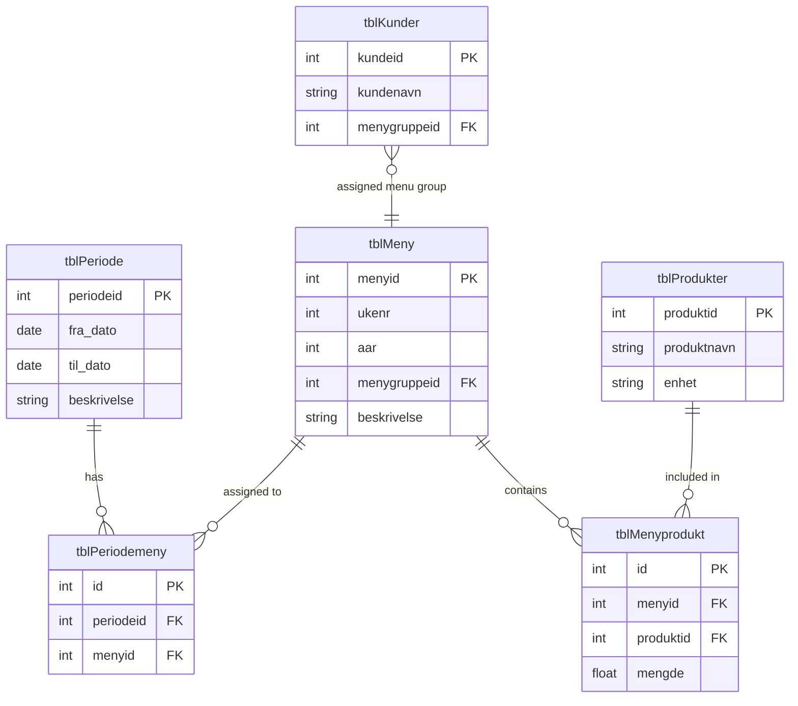

# Menu System Design and Relationships

## Overview

The menu system is designed to manage weekly menus with flexible periods, allowing for diet-specific menus and product associations. The system links customers to menu groups, enabling period-based reporting.

## Database Tables and Relationships

### Core Tables

1. **tblMeny** (Main Menu Table)
   - Primary table containing menus for each week of the year
   - Can support multiple menu types (regular, diet-specific, etc.)
   - Contains `menygruppeid` for categorizing menus

2. **tblPeriode** (Period Definition)
   - Defines time periods with from/to dates
   - Typically weekly but supports any date range
   - Used to determine active menu periods

3. **tblPeriodemeny** (Period-Menu Junction)
   - Links periods to menus
   - Allows multiple menus per period
   - Enables time-based menu activation

4. **tblMenyprodukt** (Menu-Product Junction)
   - Associates products with specific menus
   - Allows building product lists for upcoming periods
   - Typically covers 4 periods ahead (but flexible)

5. **tblKunder** (Customers)
   - Contains `menygruppeid` field
   - Links customers to specific menu groups
   - Enables diet-specific menu assignments

6. **tblProdukter** (Products)
   - Product catalog
   - Linked to menus via tblMenyprodukt

## Relationships Diagram



## Implementation Tasks

### 1. Create Menu Management Page

**Purpose**: Display and manage menu-period-product relationships

**Features Required**:
- [ ] View active periods with their assigned menus
- [ ] Display products for each menu
- [ ] Filter by menu group (diet types)
- [ ] Edit period assignments
- [ ] Manage menu products

**Components**:
- Period selector/calendar view
- Menu list with filtering
- Product assignment interface
- Menu group management

### 2. Create Period-Based Customer Report

**Purpose**: Generate reports showing customers and their menus for specific periods

**Report Requirements**:
- [ ] Select reporting period (date range)
- [ ] Group customers by menygruppeid
- [ ] Show menu assignments for the period
- [ ] List products per customer group
- [ ] Export capabilities (PDF/Excel)

**Report Sections**:
1. **Summary Section**
   - Total customers per menu group
   - Period dates
   - Total unique products needed

2. **Detail Section**
   - Customer list by menu group
   - Assigned menu for period
   - Product list with quantities

3. **Product Aggregation**
   - Total quantities needed per product
   - Grouped by menu group

### 3. API Endpoints Needed

```typescript
// Period Management
GET    /api/v1/perioder
POST   /api/v1/perioder
PUT    /api/v1/perioder/:id
DELETE /api/v1/perioder/:id

// Period-Menu Relationships (OPPDATERT 2025-10-22: endpoint uses hyphens)
GET    /api/v1/periode-meny
POST   /api/v1/periode-meny
DELETE /api/v1/periode-meny/:id

// Menu-Product Relationships (OPPDATERT 2025-10-22: endpoint uses hyphens)
GET    /api/v1/meny-produkt
POST   /api/v1/meny-produkt
PUT    /api/v1/meny-produkt/:id
DELETE /api/v1/meny-produkt/:id

// Reporting Endpoints
GET    /api/v1/reports/period-customers
GET    /api/v1/reports/period-products
POST   /api/v1/reports/generate-period-report
```

### 4. Frontend Pages

#### Menu Management Page (`/menus/management`)
- **Layout**: Split view with periods on left, menus/products on right
- **Features**:
  - Period timeline/calendar
  - Menu assignment drag-and-drop
  - Product search and assignment
  - Menu group filtering

#### Period Customer Report Page (`/reports/period-customers`)
- **Layout**: Report configuration form + preview
- **Features**:
  - Date range picker
  - Menu group multi-select
  - Report preview
  - Export options

### 5. Business Logic Implementation

1. **Period Activation Logic**
   ```python
   # Check if current date falls within period
   # Activate menus for active periods
   # Handle overlapping periods
   ```

2. **Menu Assignment Logic**
   ```python
   # Assign menus based on customer menygruppeid
   # Handle special diet requirements
   # Manage default vs. custom assignments
   ```

3. **Product Aggregation Logic**
   ```python
   # Calculate total products needed per period
   # Group by customer menu groups
   # Handle quantity calculations
   ```

## Data Flow

1. **Period Setup** → Admin creates periods (usually weekly)
2. **Menu Assignment** → Menus assigned to periods via tblPeriodemeny
3. **Product Assignment** → Products linked to menus via tblMenyprodukt
4. **Customer Assignment** → Customers linked via menygruppeid
5. **Report Generation** → System aggregates data for active period

## Additional Considerations

- **Performance**: Index on date fields for period queries
- **Validation**: Ensure no gaps in period coverage
- **Flexibility**: Support for special periods (holidays, etc.)
- **History**: Maintain historical menu assignments
- **Permissions**: Role-based access for menu management

## Next Steps

1. Implement database relationships and constraints
2. Create API endpoints for period/menu management
3. Build frontend menu management interface
4. Develop reporting functionality
5. Add data validation and business rules
6. Create user documentation