# Systemflyt og Prosessdokumentasjon
# Larvik Kommune Catering System (LKC)

**Versjon:** 2.8.0
**Sist oppdatert:** 2026-01-18

---

## Innholdsfortegnelse

1. [Systemarkitektur](#systemarkitektur)
2. [Perioder og Menyplanlegging](#perioder-og-menyplanlegging)
3. [Produksjonssystem for Mottakskjøkken](#produksjonssystem-for-mottakskjøkken)
4. [Oppskrifts- og Produktstyring](#oppskrifts--og-produktstyring)
5. [Bestillings- og Ordreflyt](#bestillings--og-ordreflyt)
6. [Webshop-flyt](#webshop-flyt)
7. [Rapportering og Analyse](#rapportering-og-analyse)
8. [Bruksscenarier](#bruksscenarier)

---

## Systemarkitektur

### Overordnet systemstruktur

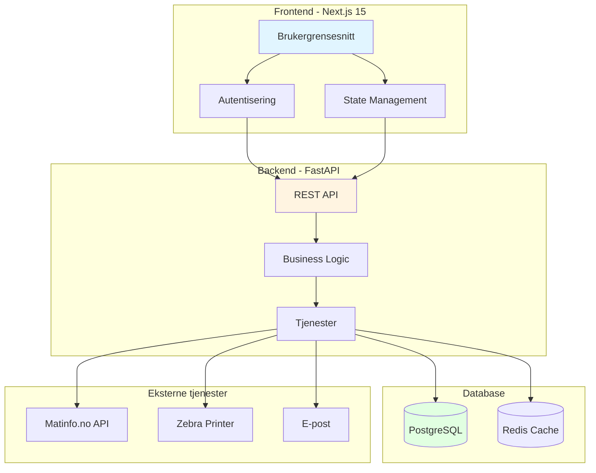
```mermaid
graph TB
    subgraph "Frontend - Next.js 15"
        UI[Brukergrensesnitt]
        Auth[Autentisering]
        State[State Management]
    end

    subgraph "Backend - FastAPI"
        API[REST API]
        BL[Business Logic]
        Services[Tjenester]
    end

    subgraph "Database"
        PG[(PostgreSQL)]
        Redis[(Redis Cache)]
    end

    subgraph "Eksterne tjenester"
        Matinfo[Matinfo.no API]
        Zebra[Zebra Printer]
        Email[E-post]
    end

    UI --> Auth
    Auth --> API
    UI --> State
    State --> API

    API --> BL
    BL --> Services
    Services --> PG
    Services --> Redis
    Services --> Matinfo
    Services --> Zebra
    Services --> Email

    style UI fill:#e1f5ff
    style API fill:#fff4e1
    style PG fill:#e1ffe1
```

### Hovedmoduler

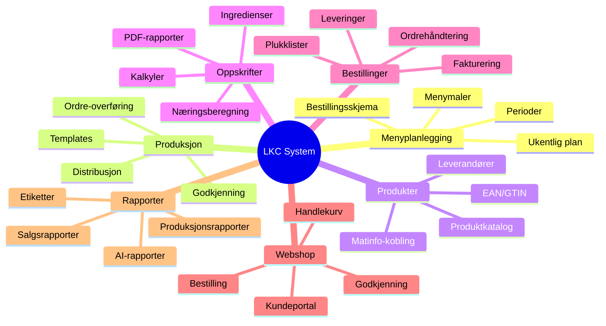
```mermaid
mindmap
  root((LKC System))
    Menyplanlegging
      Perioder
      Menymaler
      Ukentlig plan
      Bestillingsskjema
    Produksjon
      Templates
      Distribusjon
      Godkjenning
      Ordre-overføring
    Produkter
      Produktkatalog
      EAN/GTIN
      Matinfo-kobling
      Leverandører
    Oppskrifter
      Kalkyler
      Ingredienser
      Næringsberegning
      PDF-rapporter
    Bestillinger
      Ordrehåndtering
      Plukklister
      Leveringer
      Fakturering
    Webshop
      Kundeportal
      Handlekurv
      Bestilling
      Godkjenning
    Rapporter
      Salgsrapporter
      Produksjonsrapporter
      AI-rapporter
      Etiketter
```

---

## Perioder og Menyplanlegging

### Komplett periodeflyt

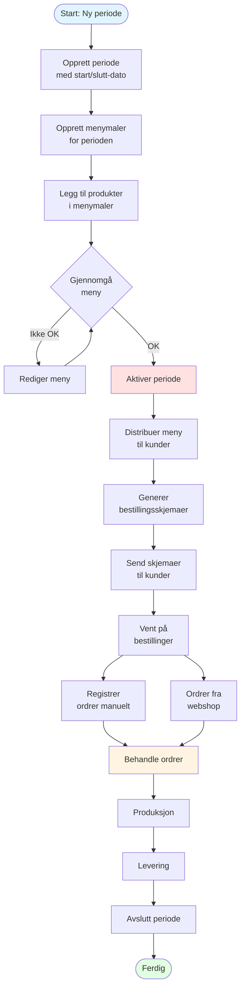
```mermaid
flowchart TD
    Start([Start: Ny periode]) --> CreatePeriod[Opprett periode<br/>med start/slutt-dato]
    CreatePeriod --> CreateTemplates[Opprett menymaler<br/>for perioden]

    CreateTemplates --> AddProducts[Legg til produkter<br/>i menymaler]
    AddProducts --> ReviewMenu{Gjennomgå<br/>meny}

    ReviewMenu -->|Ikke OK| EditMenu[Rediger meny]
    EditMenu --> ReviewMenu
    ReviewMenu -->|OK| ActivatePeriod[Aktiver periode]

    ActivatePeriod --> DistributeMenu[Distribuer meny<br/>til kunder]
    DistributeMenu --> GenerateForms[Generer<br/>bestillingsskjemaer]

    GenerateForms --> SendForms[Send skjemaer<br/>til kunder]
    SendForms --> WaitOrders[Vent på<br/>bestillinger]

    WaitOrders --> RegisterOrders[Registrer<br/>ordrer manuelt]
    WaitOrders --> WebshopOrders[Ordrer fra<br/>webshop]

    RegisterOrders --> ProcessOrders[Behandle ordrer]
    WebshopOrders --> ProcessOrders

    ProcessOrders --> Production[Produksjon]
    Production --> Delivery[Levering]
    Delivery --> ClosePeriod[Avslutt periode]
    ClosePeriod --> End([Ferdig])

    style Start fill:#e1f5ff
    style ActivatePeriod fill:#ffe1e1
    style ProcessOrders fill:#fff4e1
    style End fill:#e1ffe1
```

### Periodeadministrasjon - detaljert

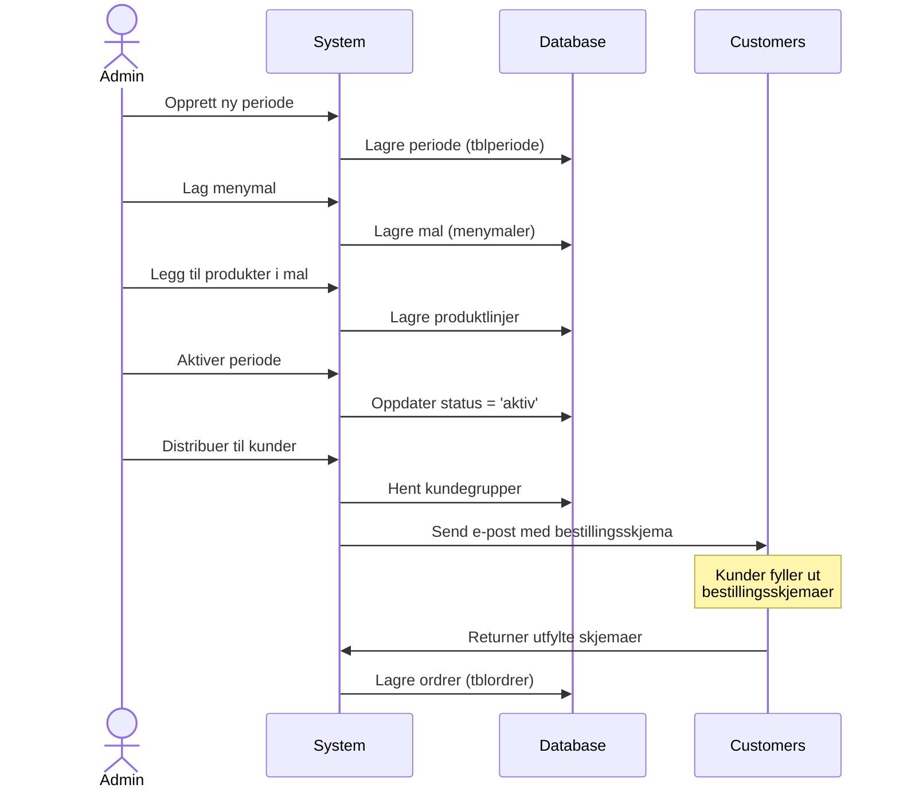
```mermaid
sequenceDiagram
    actor Admin
    participant System
    participant Database
    participant Customers

    Admin->>System: Opprett ny periode
    System->>Database: Lagre periode (tblperiode)

    Admin->>System: Lag menymal
    System->>Database: Lagre mal (menymaler)

    Admin->>System: Legg til produkter i mal
    System->>Database: Lagre produktlinjer

    Admin->>System: Aktiver periode
    System->>Database: Oppdater status = 'aktiv'

    Admin->>System: Distribuer til kunder
    System->>Database: Hent kundegrupper
    System->>Customers: Send e-post med bestillingsskjema

    Note over Customers: Kunder fyller ut<br/>bestillingsskjemaer

    Customers->>System: Returner utfylte skjemaer
    System->>Database: Lagre ordrer (tblordrer)
```

---

## Produksjonssystem for Mottakskjøkken

### Komplett produksjonsflyt (v2.8.0)

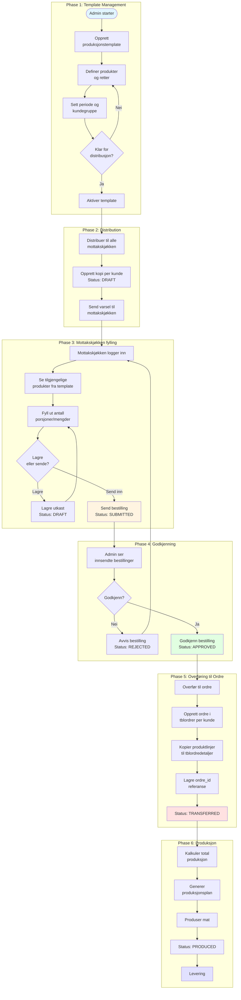
```mermaid
flowchart TD
    subgraph "Phase 1: Template Management"
        A1([Admin starter]) --> A2[Opprett<br/>produksjonstemplate]
        A2 --> A3[Definer produkter<br/>og retter]
        A3 --> A4[Sett periode og<br/>kundegruppe]
        A4 --> A5{Klar for<br/>distribusjon?}
        A5 -->|Nei| A3
        A5 -->|Ja| A6[Aktiver template]
    end

    subgraph "Phase 2: Distribution"
        A6 --> B1[Distribuer til alle<br/>mottakskjøkken]
        B1 --> B2[Opprett kopi per kunde<br/>Status: DRAFT]
        B2 --> B3[Send varsel til<br/>mottakskjøkken]
    end

    subgraph "Phase 3: Mottakskjøkken fylling"
        B3 --> C1[Mottakskjøkken logger inn]
        C1 --> C2[Se tilgjengelige<br/>produkter fra template]
        C2 --> C3[Fyll ut antall<br/>porsjoner/mengder]
        C3 --> C4{Lagre<br/>eller sende?}
        C4 -->|Lagre| C5[Lagre utkast<br/>Status: DRAFT]
        C5 --> C3
        C4 -->|Send inn| C6[Send bestilling<br/>Status: SUBMITTED]
    end

    subgraph "Phase 4: Godkjenning"
        C6 --> D1[Admin ser<br/>innsendte bestillinger]
        D1 --> D2{Godkjenn?}
        D2 -->|Nei| D3[Avvis bestilling<br/>Status: REJECTED]
        D3 --> C1
        D2 -->|Ja| D4[Godkjenn bestilling<br/>Status: APPROVED]
    end

    subgraph "Phase 5: Overføring til Ordre"
        D4 --> E1[Overfør til ordre]
        E1 --> E2[Opprett ordre i<br/>tblordrer per kunde]
        E2 --> E3[Kopier produktlinjer<br/>til tblordredetaljer]
        E3 --> E4[Lagre ordre_id<br/>referanse]
        E4 --> E5[Status: TRANSFERRED]
    end

    subgraph "Phase 6: Produksjon"
        E5 --> F1[Kalkuler total<br/>produksjon]
        F1 --> F2[Generer<br/>produksjonsplan]
        F2 --> F3[Produser mat]
        F3 --> F4[Status: PRODUCED]
        F4 --> F5[Levering]
    end

    style A1 fill:#e1f5ff
    style C6 fill:#fff4e1
    style D4 fill:#e1ffe1
    style E5 fill:#ffe1e1
    style F5 fill:#e1e1ff
```

### Produksjonstemplate struktur

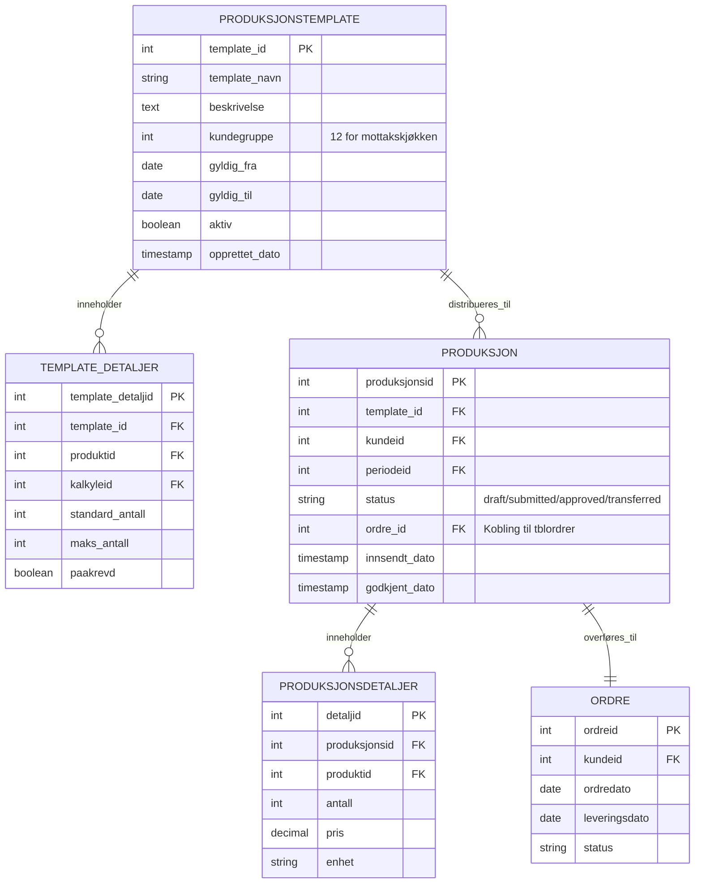
```mermaid
erDiagram
    PRODUKSJONSTEMPLATE ||--o{ TEMPLATE_DETALJER : inneholder
    PRODUKSJONSTEMPLATE ||--o{ PRODUKSJON : distribueres_til
    PRODUKSJON ||--o{ PRODUKSJONSDETALJER : inneholder
    PRODUKSJON ||--|| ORDRE : overføres_til

    PRODUKSJONSTEMPLATE {
        int template_id PK
        string template_navn
        text beskrivelse
        int kundegruppe "12 for mottakskjøkken"
        date gyldig_fra
        date gyldig_til
        boolean aktiv
        timestamp opprettet_dato
    }

    TEMPLATE_DETALJER {
        int template_detaljid PK
        int template_id FK
        int produktid FK
        int kalkyleid FK
        int standard_antall
        int maks_antall
        boolean paakrevd
    }

    PRODUKSJON {
        int produksjonsid PK
        int template_id FK
        int kundeid FK
        int periodeid FK
        string status "draft/submitted/approved/transferred"
        int ordre_id FK "Kobling til tblordrer"
        timestamp innsendt_dato
        timestamp godkjent_dato
    }

    PRODUKSJONSDETALJER {
        int detaljid PK
        int produksjonsid FK
        int produktid FK
        int antall
        decimal pris
        string enhet
    }

    ORDRE {
        int ordreid PK
        int kundeid FK
        date ordredato
        date leveringsdato
        string status
    }
```

### Statusflyt i produksjonssystemet

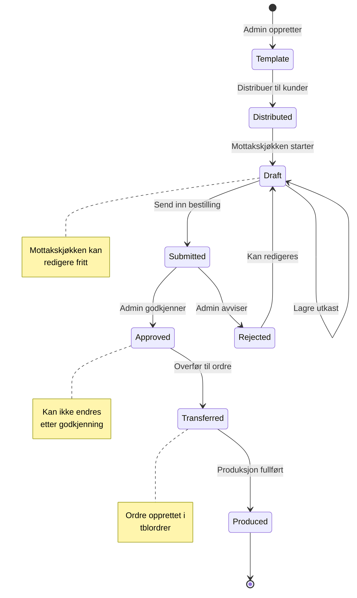
```mermaid
stateDiagram-v2
    [*] --> Template: Admin oppretter
    Template --> Distributed: Distribuer til kunder

    Distributed --> Draft: Mottakskjøkken starter
    Draft --> Draft: Lagre utkast
    Draft --> Submitted: Send inn bestilling

    Submitted --> Approved: Admin godkjenner
    Submitted --> Rejected: Admin avviser

    Rejected --> Draft: Kan redigeres

    Approved --> Transferred: Overfør til ordre
    Transferred --> Produced: Produksjon fullført

    Produced --> [*]

    note right of Draft
        Mottakskjøkken kan
        redigere fritt
    end note

    note right of Approved
        Kan ikke endres
        etter godkjenning
    end note

    note right of Transferred
        Ordre opprettet i
        tblordrer
    end note
```

---

## Oppskrifts- og Produktstyring

### Oppskriftsflyt med kalkulering

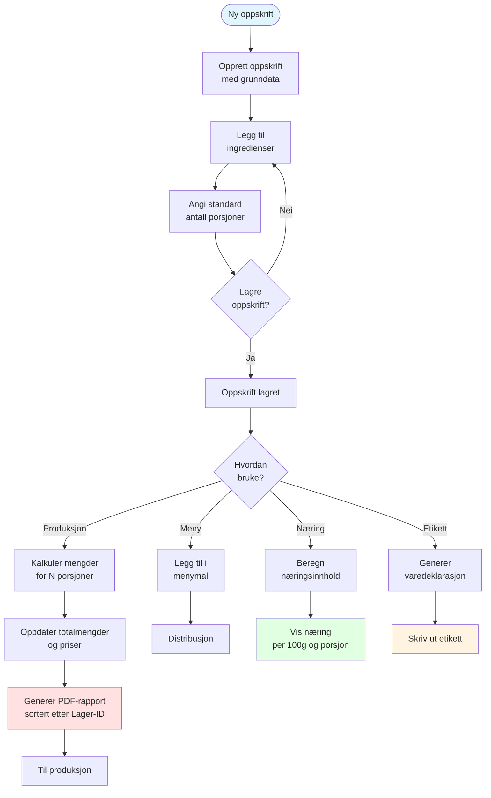
```mermaid
flowchart TD
    Start([Ny oppskrift]) --> Create[Opprett oppskrift<br/>med grunndata]
    Create --> AddIngredients[Legg til<br/>ingredienser]

    AddIngredients --> SetPortions[Angi standard<br/>antall porsjoner]
    SetPortions --> SaveRecipe{Lagre<br/>oppskrift?}

    SaveRecipe -->|Nei| AddIngredients
    SaveRecipe -->|Ja| Saved[Oppskrift lagret]

    Saved --> UseRecipe{Hvordan<br/>bruke?}

    UseRecipe -->|Produksjon| Calculate[Kalkuler mengder<br/>for N porsjoner]
    Calculate --> UpdateAmounts[Oppdater totalmengder<br/>og priser]
    UpdateAmounts --> GeneratePDF[Generer PDF-rapport<br/>sortert etter Lager-ID]
    GeneratePDF --> Production[Til produksjon]

    UseRecipe -->|Meny| AddToMenu[Legg til i<br/>menymal]
    AddToMenu --> Distribution[Distribusjon]

    UseRecipe -->|Næring| CalcNutrition[Beregn<br/>næringsinnhold]
    CalcNutrition --> ShowNutrition[Vis næring<br/>per 100g og porsjon]

    UseRecipe -->|Etikett| GenLabel[Generer<br/>varedeklarasjon]
    GenLabel --> PrintLabel[Skriv ut etikett]

    style Start fill:#e1f5ff
    style GeneratePDF fill:#ffe1e1
    style ShowNutrition fill:#e1ffe1
    style PrintLabel fill:#fff4e1
```

### Produktkobling med Matinfo

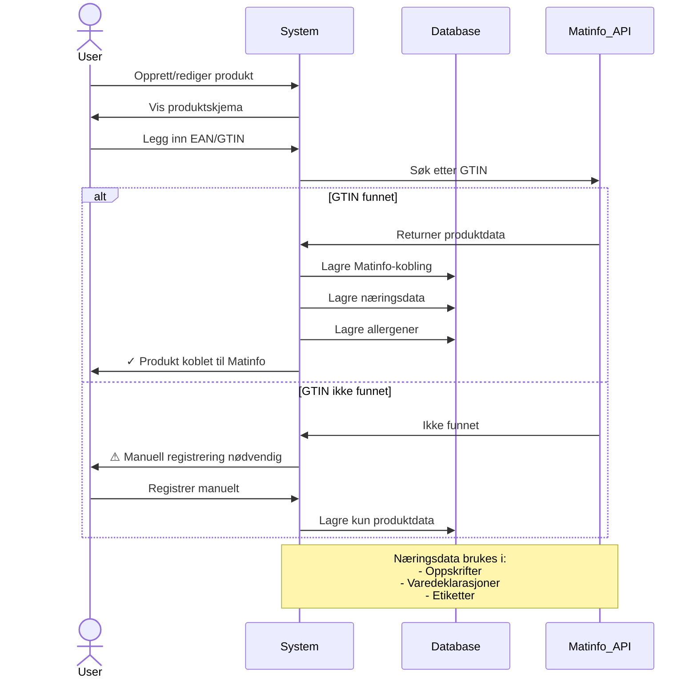
```mermaid
sequenceDiagram
    actor User
    participant System
    participant Database
    participant Matinfo_API

    User->>System: Opprett/rediger produkt
    System->>User: Vis produktskjema

    User->>System: Legg inn EAN/GTIN
    System->>Matinfo_API: Søk etter GTIN

    alt GTIN funnet
        Matinfo_API->>System: Returner produktdata
        System->>Database: Lagre Matinfo-kobling
        System->>Database: Lagre næringsdata
        System->>Database: Lagre allergener
        System->>User: ✓ Produkt koblet til Matinfo
    else GTIN ikke funnet
        Matinfo_API->>System: Ikke funnet
        System->>User: ⚠ Manuell registrering nødvendig
        User->>System: Registrer manuelt
        System->>Database: Lagre kun produktdata
    end

    Note over System,Matinfo_API: Næringsdata brukes i:<br/>- Oppskrifter<br/>- Varedeklarasjoner<br/>- Etiketter
```

### Oppskriftskalkulering (v2.7.0)

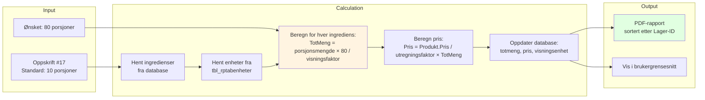
```mermaid
flowchart LR
    subgraph Input
        Recipe[Oppskrift #17<br/>Standard: 10 porsjoner]
        Portions[Ønsket: 80 porsjoner]
    end

    subgraph Calculation
        GetIngredients[Hent ingredienser<br/>fra database]
        GetUnits[Hent enheter fra<br/>tbl_rptabenheter]
        Calculate[Beregn for hver ingrediens:<br/>TotMeng = porsjonsmengde × 80 / visningsfaktor]
        CalcPrice[Beregn pris:<br/>Pris = Produkt.Pris / utregningsfaktor × TotMeng]
        Update[Oppdater database:<br/>totmeng, pris, visningsenhet]
    end

    subgraph Output
        PDF[PDF-rapport<br/>sortert etter Lager-ID]
        Display[Vis i brukergrensesnitt]
    end

    Recipe --> GetIngredients
    Portions --> Calculate
    GetIngredients --> GetUnits
    GetUnits --> Calculate
    Calculate --> CalcPrice
    CalcPrice --> Update
    Update --> PDF
    Update --> Display

    style Calculate fill:#fff4e1
    style PDF fill:#e1ffe1
```

---

## Bestillings- og Ordreflyt

### Komplett ordreflyt

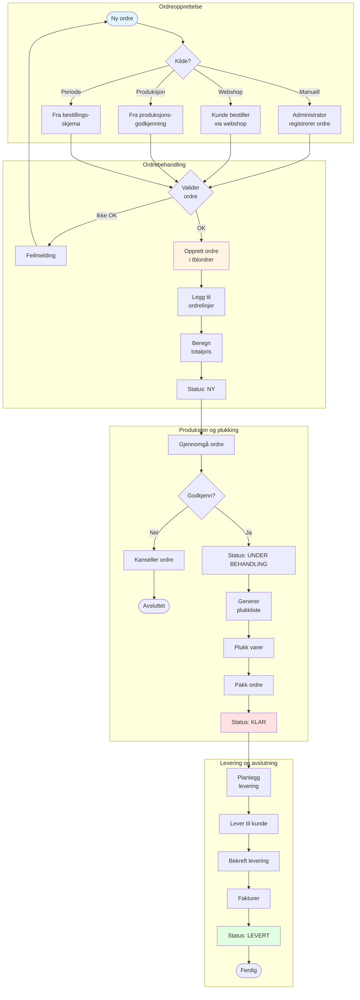
```mermaid
flowchart TD
    subgraph "Ordreopprettelse"
        Start([Ny ordre]) --> Source{Kilde?}
        Source -->|Manuell| Manual[Administrator<br/>registrerer ordre]
        Source -->|Webshop| Web[Kunde bestiller<br/>via webshop]
        Source -->|Produksjon| Prod[Fra produksjons-<br/>godkjenning]
        Source -->|Periode| Period[Fra bestillings-<br/>skjema]
    end

    subgraph "Ordrebehandling"
        Manual --> Validate{Valider<br/>ordre}
        Web --> Validate
        Prod --> Validate
        Period --> Validate

        Validate -->|Ikke OK| Error[Feilmelding]
        Error --> Start

        Validate -->|OK| CreateOrder[Opprett ordre<br/>i tblordrer]
        CreateOrder --> AddLines[Legg til<br/>ordrelinjer]
        AddLines --> CalcTotal[Beregn<br/>totalpris]
        CalcTotal --> SetStatus[Status: NY]
    end

    subgraph "Produksjon og plukking"
        SetStatus --> Review[Gjennomgå ordre]
        Review --> Approve{Godkjenn?}

        Approve -->|Nei| Cancel[Kanseller ordre]
        Cancel --> End1([Avsluttet])

        Approve -->|Ja| Process[Status: UNDER BEHANDLING]
        Process --> GenPickList[Generer<br/>plukkliste]
        GenPickList --> Pick[Plukk varer]
        Pick --> Pack[Pakk ordre]
        Pack --> Ready[Status: KLAR]
    end

    subgraph "Levering og avslutning"
        Ready --> Schedule[Planlegg<br/>levering]
        Schedule --> Deliver[Lever til kunde]
        Deliver --> Confirm[Bekreft levering]
        Confirm --> Invoice[Fakturer]
        Invoice --> Complete[Status: LEVERT]
        Complete --> End2([Ferdig])
    end

    style Start fill:#e1f5ff
    style CreateOrder fill:#fff4e1
    style Ready fill:#ffe1e1
    style Complete fill:#e1ffe1
```

### Plukkeprosess

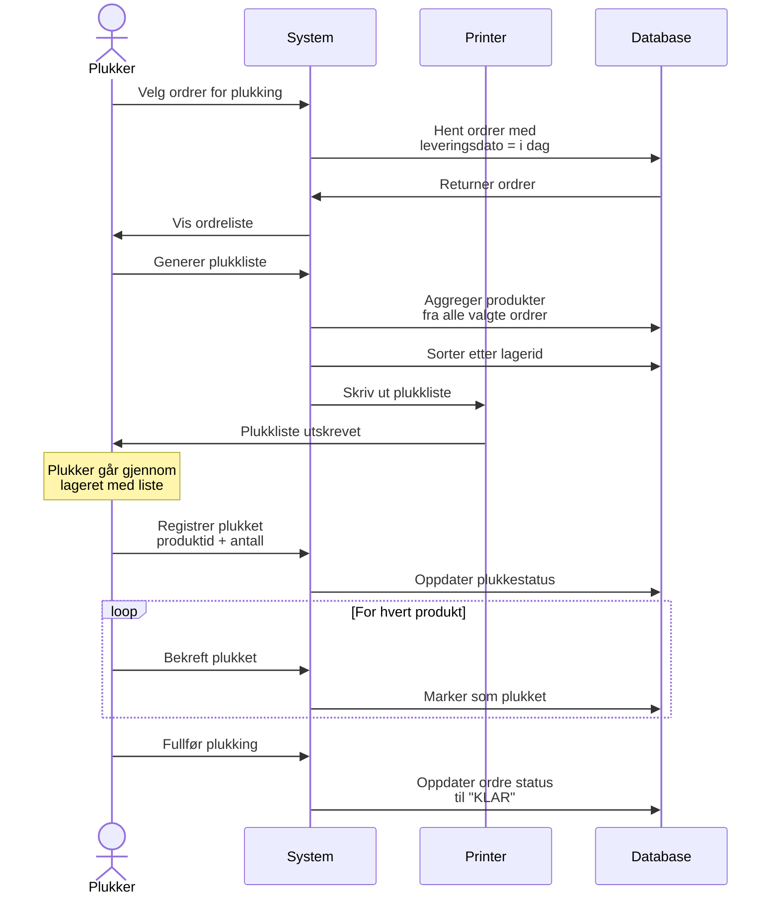
```mermaid
sequenceDiagram
    actor Plukker
    participant System
    participant Printer
    participant Database

    Plukker->>System: Velg ordrer for plukking
    System->>Database: Hent ordrer med<br/>leveringsdato = i dag
    Database->>System: Returner ordrer

    System->>Plukker: Vis ordreliste
    Plukker->>System: Generer plukkliste

    System->>Database: Aggreger produkter<br/>fra alle valgte ordrer
    System->>Database: Sorter etter lagerid
    System->>Printer: Skriv ut plukkliste

    Printer->>Plukker: Plukkliste utskrevet

    Note over Plukker: Plukker går gjennom<br/>lageret med liste

    Plukker->>System: Registrer plukket<br/>produktid + antall
    System->>Database: Oppdater plukkestatus

    loop For hvert produkt
        Plukker->>System: Bekreft plukket
        System->>Database: Marker som plukket
    end

    Plukker->>System: Fullfør plukking
    System->>Database: Oppdater ordre status<br/>til "KLAR"
```

---

## Webshop-flyt

### Komplett webshop-prosess

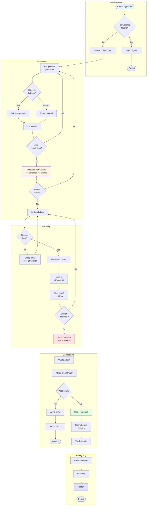
```mermaid
flowchart TD
    subgraph "Kundeaksess"
        Start([Kunde logger inn]) --> CheckAccess{Har webshop-<br/>tilgang?}
        CheckAccess -->|Nei| Denied[Ingen tilgang]
        Denied --> End1([Avslutt])
        CheckAccess -->|Ja| Dashboard[Webshop dashboard]
    end

    subgraph "Handlekurv"
        Dashboard --> Browse[Bla gjennom<br/>produkter]
        Browse --> Search{Søk eller<br/>kategori?}
        Search -->|Søk| SearchProd[Søk etter produkt]
        Search -->|Kategori| FilterCat[Filtrer kategori]

        SearchProd --> ViewProduct[Vis produkt]
        FilterCat --> ViewProduct

        ViewProduct --> AddCart{Legg i<br/>handlekurv?}
        AddCart -->|Nei| Browse
        AddCart -->|Ja| UpdateCart[Oppdater handlekurv<br/>localStorage + backend]
        UpdateCart --> Continue{Fortsett<br/>handle?}
        Continue -->|Ja| Browse
        Continue -->|Nei| ViewCart[Se handlekurv]
    end

    subgraph "Bestilling"
        ViewCart --> EditCart{Rediger<br/>kurv?}
        EditCart -->|Ja| UpdateQuantity[Endre antall<br/>eller fjern varer]
        UpdateQuantity --> ViewCart

        EditCart -->|Nei| SelectDelivery[Velg leveringsdato]
        SelectDelivery --> AddComment[Legg til<br/>kommentar]
        AddComment --> ReviewOrder[Gjennomgå<br/>bestilling]
        ReviewOrder --> Confirm{Bekreft<br/>bestilling?}

        Confirm -->|Nei| ViewCart
        Confirm -->|Ja| SubmitOrder[Send bestilling<br/>Status: DRAFT]
    end

    subgraph "Godkjenning"
        SubmitOrder --> AdminNotify[Varsle admin]
        AdminNotify --> AdminReview[Admin gjennomgår]
        AdminReview --> AdminDecision{Godkjenn?}

        AdminDecision -->|Nei| Reject[Avvis ordre]
        Reject --> NotifyReject[Varsle kunde]
        NotifyReject --> End2([Avsluttet])

        AdminDecision -->|Ja| Approve[Godkjenn ordre]
        Approve --> CreateOrder[Opprett ordre<br/>i tblordrer]
        CreateOrder --> NotifyApprove[Varsle kunde]
    end

    subgraph "Behandling"
        NotifyApprove --> Process[Behandle ordre]
        Process --> Deliver[Levering]
        Deliver --> Complete[Fullført]
        Complete --> End3([Ferdig])
    end

    style Start fill:#e1f5ff
    style UpdateCart fill:#fff4e1
    style SubmitOrder fill:#ffe1e1
    style Approve fill:#e1ffe1
    style Complete fill:#e1e1ff
```

### Handlekurv-synkronisering

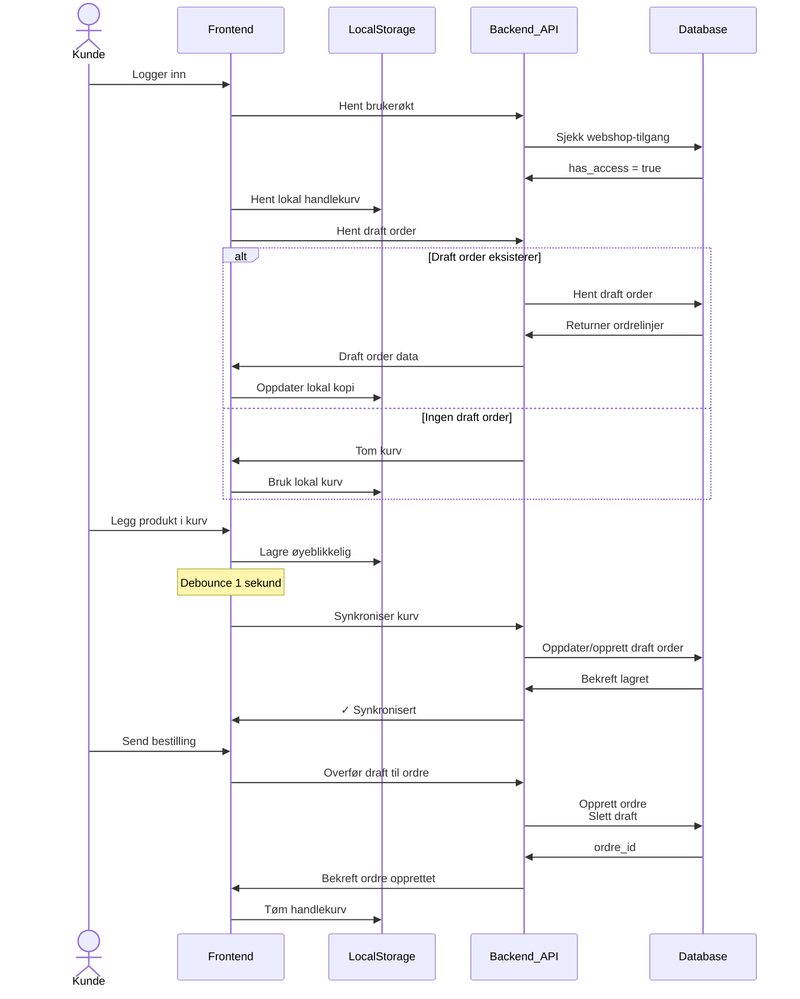
```mermaid
sequenceDiagram
    actor Kunde
    participant Frontend
    participant LocalStorage
    participant Backend_API
    participant Database

    Kunde->>Frontend: Logger inn
    Frontend->>Backend_API: Hent brukerøkt
    Backend_API->>Database: Sjekk webshop-tilgang
    Database->>Backend_API: has_access = true

    Frontend->>LocalStorage: Hent lokal handlekurv
    Frontend->>Backend_API: Hent draft order

    alt Draft order eksisterer
        Backend_API->>Database: Hent draft order
        Database->>Backend_API: Returner ordrelinjer
        Backend_API->>Frontend: Draft order data
        Frontend->>LocalStorage: Oppdater lokal kopi
    else Ingen draft order
        Backend_API->>Frontend: Tom kurv
        Frontend->>LocalStorage: Bruk lokal kurv
    end

    Kunde->>Frontend: Legg produkt i kurv
    Frontend->>LocalStorage: Lagre øyeblikkelig

    Note over Frontend: Debounce 1 sekund

    Frontend->>Backend_API: Synkroniser kurv
    Backend_API->>Database: Oppdater/opprett draft order
    Database->>Backend_API: Bekreft lagret
    Backend_API->>Frontend: ✓ Synkronisert

    Kunde->>Frontend: Send bestilling
    Frontend->>Backend_API: Overfør draft til ordre
    Backend_API->>Database: Opprett ordre<br/>Slett draft
    Database->>Backend_API: ordre_id
    Backend_API->>Frontend: Bekreft ordre opprettet
    Frontend->>LocalStorage: Tøm handlekurv
```

---

## Rapportering og Analyse

### Rapportflyt

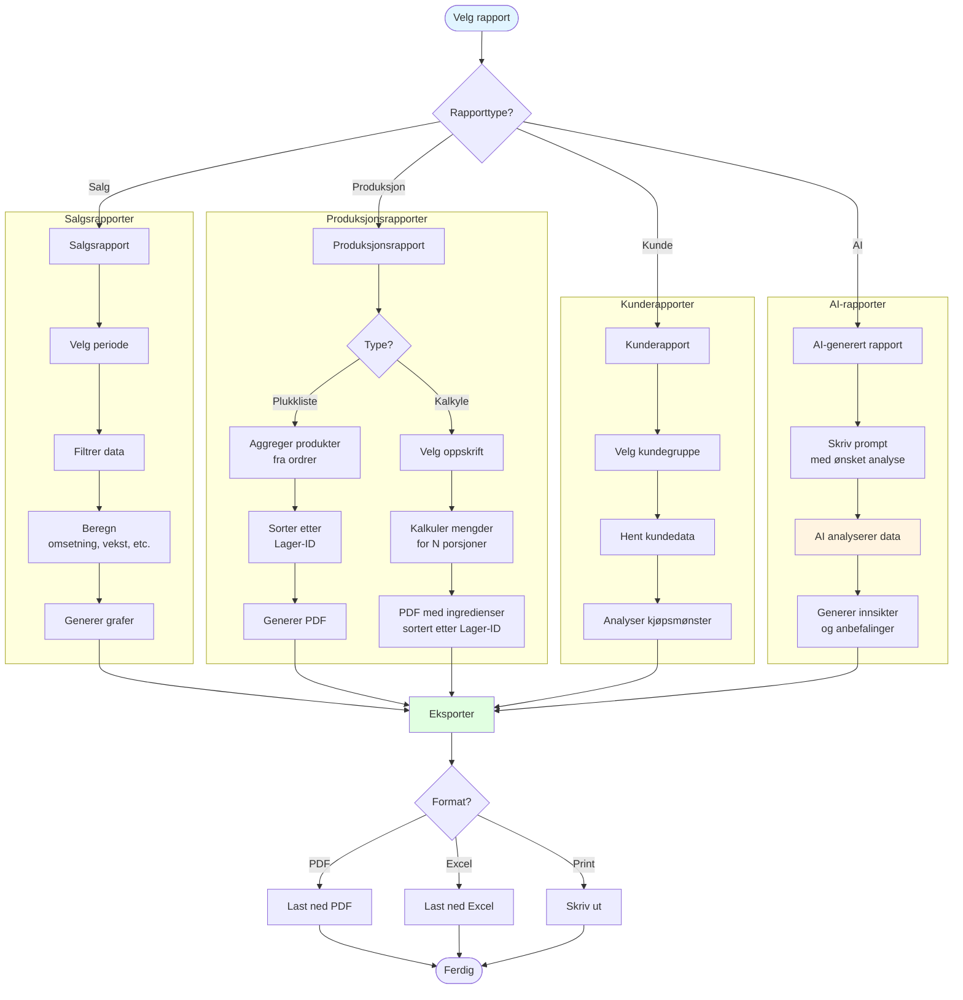
```mermaid
flowchart TD
    Start([Velg rapport]) --> Type{Rapporttype?}

    Type -->|Salg| Sales[Salgsrapport]
    Type -->|Produksjon| Production[Produksjonsrapport]
    Type -->|Kunde| Customer[Kunderapport]
    Type -->|AI| AI[AI-generert rapport]

    subgraph "Salgsrapporter"
        Sales --> SalesPeriod[Velg periode]
        SalesPeriod --> SalesFilter[Filtrer data]
        SalesFilter --> SalesCalc[Beregn<br/>omsetning, vekst, etc.]
        SalesCalc --> SalesChart[Generer grafer]
    end

    subgraph "Produksjonsrapporter"
        Production --> ProdType{Type?}
        ProdType -->|Plukkliste| Pick[Aggreger produkter<br/>fra ordrer]
        Pick --> PickSort[Sorter etter<br/>Lager-ID]
        PickSort --> PickPDF[Generer PDF]

        ProdType -->|Kalkyle| Recipe[Velg oppskrift]
        Recipe --> RecipeCalc[Kalkuler mengder<br/>for N porsjoner]
        RecipeCalc --> RecipePDF[PDF med ingredienser<br/>sortert etter Lager-ID]
    end

    subgraph "Kunderapporter"
        Customer --> CustFilter[Velg kundegruppe]
        CustFilter --> CustData[Hent kundedata]
        CustData --> CustAnalysis[Analyser kjøpsmønster]
    end

    subgraph "AI-rapporter"
        AI --> AIPrompt[Skriv prompt<br/>med ønsket analyse]
        AIPrompt --> AIProcess[AI analyserer data]
        AIProcess --> AIInsights[Generer innsikter<br/>og anbefalinger]
    end

    SalesChart --> Export
    PickPDF --> Export
    RecipePDF --> Export
    CustAnalysis --> Export
    AIInsights --> Export

    Export[Eksporter] --> Format{Format?}
    Format -->|PDF| PDF[Last ned PDF]
    Format -->|Excel| Excel[Last ned Excel]
    Format -->|Print| Print[Skriv ut]

    PDF --> End([Ferdig])
    Excel --> End
    Print --> End

    style Start fill:#e1f5ff
    style AIProcess fill:#fff4e1
    style Export fill:#e1ffe1
```

---

## Bruksscenarier

### Scenario 1: Ny menyperiode fra A til Å

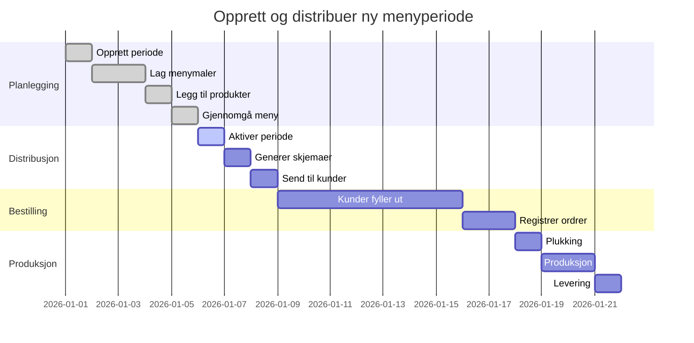
```mermaid
gantt
    title Opprett og distribuer ny menyperiode
    dateFormat YYYY-MM-DD
    section Planlegging
    Opprett periode           :done, p1, 2026-01-01, 1d
    Lag menymaler            :done, p2, after p1, 2d
    Legg til produkter       :done, p3, after p2, 1d
    Gjennomgå meny          :done, p4, after p3, 1d

    section Distribusjon
    Aktiver periode          :active, d1, after p4, 1d
    Generer skjemaer        :d2, after d1, 1d
    Send til kunder         :d3, after d2, 1d

    section Bestilling
    Kunder fyller ut        :b1, after d3, 7d
    Registrer ordrer        :b2, after b1, 2d

    section Produksjon
    Plukking                :pr1, after b2, 1d
    Produksjon              :pr2, after pr1, 2d
    Levering                :pr3, after pr2, 1d
```

### Scenario 2: Mottakskjøkken produksjonsbestilling

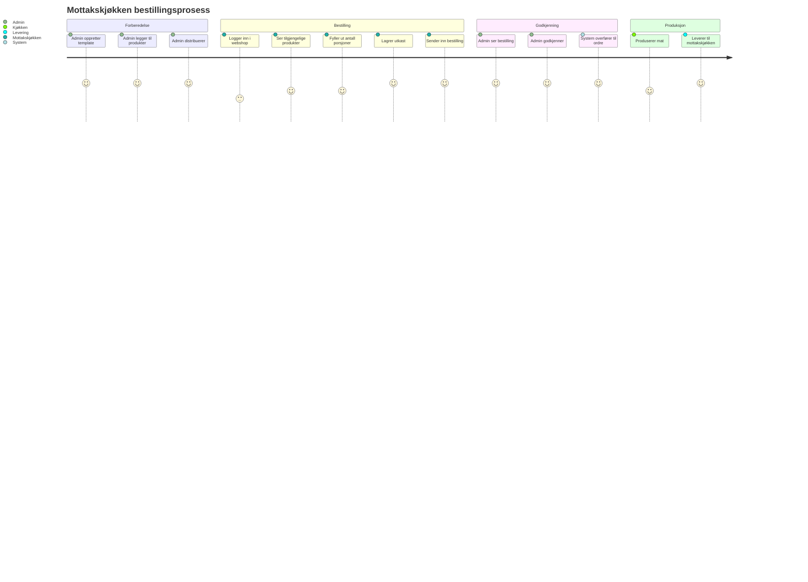
```mermaid
journey
    title Mottakskjøkken bestillingsprosess
    section Forberedelse
      Admin oppretter template: 5: Admin
      Admin legger til produkter: 5: Admin
      Admin distribuerer: 5: Admin
    section Bestilling
      Logger inn i webshop: 3: Mottakskjøkken
      Ser tilgjengelige produkter: 4: Mottakskjøkken
      Fyller ut antall porsjoner: 4: Mottakskjøkken
      Lagrer utkast: 5: Mottakskjøkken
      Sender inn bestilling: 5: Mottakskjøkken
    section Godkjenning
      Admin ser bestilling: 5: Admin
      Admin godkjenner: 5: Admin
      System overfører til ordre: 5: System
    section Produksjon
      Produserer mat: 4: Kjøkken
      Leverer til mottakskjøkken: 5: Levering
```

### Scenario 3: Oppskrift til produksjon

```mermaid
flowchart LR
    subgraph "Dag 1: Oppskriftutvikling"
        A1[Opprett oppskrift] --> A2[Legg til ingredienser]
        A2 --> A3[Test oppskrift]
        A3 --> A4[Juster ingredienser]
        A4 --> A5[Godkjenn oppskrift]
    end

    subgraph "Dag 2: Menyplanlegging"
        A5 --> B1[Legg oppskrift<br/>i menymal]
        B1 --> B2[Tildel til periode]
        B2 --> B3[Publiser meny]
    end

    subgraph "Dag 3-10: Bestilling"
        B3 --> C1[Kunder bestiller]
        C1 --> C2[Aggreger bestillinger]
    end

    subgraph "Dag 11: Kalkulering"
        C2 --> D1[Kalkuler oppskrift<br/>for totalt antall]
        D1 --> D2[Generer PDF-rapport<br/>sortert etter Lager-ID]
    end

    subgraph "Dag 12: Produksjon"
        D2 --> E1[Plukk ingredienser]
        E1 --> E2[Produser etter oppskrift]
        E2 --> E3[Kvalitetskontroll]
        E3 --> E4[Pakk og merk]
    end

    subgraph "Dag 13: Levering"
        E4 --> F1[Last leveringsbil]
        F1 --> F2[Lever til kunder]
        F2 --> F3[Bekreft levering]
    end

    style A5 fill:#e1ffe1
    style D2 fill:#ffe1e1
    style F3 fill:#e1f5ff
```

---

## Systemintegrasjoner

### Eksterne API-kall

```mermaid
flowchart LR
    subgraph "LKC System"
        Backend[FastAPI Backend]
    end

    subgraph "Eksterne tjenester"
        Matinfo[Matinfo.no<br/>Næringsdata]
        Email[SMTP Server<br/>E-postvarsler]
        Zebra[Zebra Printer<br/>Browser Print]
        Storage[File Storage<br/>PDF/bilder]
    end

    Backend -->|GET /products/{gtin}| Matinfo
    Matinfo -->|Næringsdata + Allergener| Backend

    Backend -->|SMTP| Email
    Email -->|Leveringsbekreftelse| Backend

    Backend -->|ZPL Commands| Zebra
    Zebra -->|Status| Backend

    Backend -->|Store/Retrieve| Storage
    Storage -->|Files| Backend

    style Backend fill:#fff4e1
    style Matinfo fill:#e1f5ff
    style Email fill:#e1ffe1
    style Zebra fill:#ffe1e1
```

---

## Database-relasjoner (forenklet)

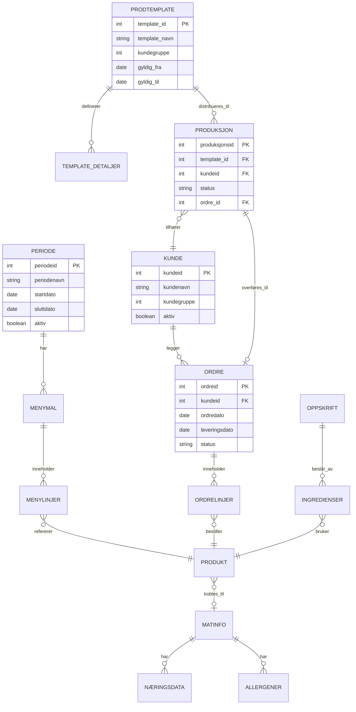
```mermaid
erDiagram
    PERIODE ||--o{ MENYMAL : har
    MENYMAL ||--o{ MENYLINJER : inneholder
    MENYLINJER }o--|| PRODUKT : refererer

    KUNDE ||--o{ ORDRE : legger
    ORDRE ||--o{ ORDRELINJER : inneholder
    ORDRELINJER }o--|| PRODUKT : bestiller

    OPPSKRIFT ||--o{ INGREDIENSER : består_av
    INGREDIENSER }o--|| PRODUKT : bruker

    PRODTEMPLATE ||--o{ TEMPLATE_DETALJER : definerer
    PRODTEMPLATE ||--o{ PRODUKSJON : distribueres_til
    PRODUKSJON }o--|| KUNDE : tilhører
    PRODUKSJON ||--o| ORDRE : overføres_til

    PRODUKT }o--o| MATINFO : kobles_til
    MATINFO ||--o{ NÆRINGSDATA : har
    MATINFO ||--o{ ALLERGENER : har

    PERIODE {
        int periodeid PK
        string periodenavn
        date startdato
        date sluttdato
        boolean aktiv
    }

    KUNDE {
        int kundeid PK
        string kundenavn
        int kundegruppe
        boolean aktiv
    }

    ORDRE {
        int ordreid PK
        int kundeid FK
        date ordredato
        date leveringsdato
        string status
    }

    PRODTEMPLATE {
        int template_id PK
        string template_navn
        int kundegruppe
        date gyldig_fra
        date gyldig_til
    }

    PRODUKSJON {
        int produksjonsid PK
        int template_id FK
        int kundeid FK
        string status
        int ordre_id FK
    }
```

---

## Brukerroller og tilganger

```mermaid
flowchart TD
    subgraph "Administrator"
        A1[Full systemtilgang]
        A2[Opprett perioder og menyer]
        A3[Administrer brukere]
        A4[Se alle rapporter]
        A5[Godkjenn bestillinger]
        A6[Systemkonfigurasjon]
    end

    subgraph "Kjøkkensjef"
        K1[Oppskriftsadministrasjon]
        K2[Produksjonsplanlegging]
        K3[Kalkulering]
        K4[Produksjonsrapporter]
        K5[Plukklister]
    end

    subgraph "Mottakskjøkken"
        M1[Webshop-tilgang]
        M2[Produksjonsbestillinger]
        M3[Se egne ordrer]
        M4[Endre utkast]
    end

    subgraph "Lager"
        L1[Plukking]
        L2[Pakking]
        L3[Lageroversikt]
        L4[Mottak]
    end

    subgraph "Økonomi"
        O1[Fakturering]
        O2[Regnskapsrapporter]
        O3[Kundeomsetning]
    end

    style A1 fill:#e1f5ff
    style K1 fill:#fff4e1
    style M1 fill:#e1ffe1
    style L1 fill:#ffe1e1
    style O1 fill:#e1e1ff
```

---

## Vedlegg: Viktige tabeller

### Hovedtabeller i systemet

| Tabell | Beskrivelse | Viktige felter |
|--------|-------------|----------------|
| `tblperiode` | Menyperioder | periodeid, periodenavn, startdato, sluttdato |
| `tblkunder` | Kunder | kundeid, kundenavn, kundegruppe |
| `tblordrer` | Bestillinger | ordreid, kundeid, ordredato, leveringsdato, status |
| `tblordredetaljer` | Ordrelinjer | detaljid, ordreid, produktid, antall, pris |
| `tblprodukter` | Produkter | produktid, produktnavn, ean_kode, pris |
| `tbl_rpkalkyle` | Oppskrifter | kalkylekode, kalkylenavn, antallporsjoner |
| `tbl_rpkalkyledetaljer` | Ingredienser | detaljid, kalkylekode, produktid, porsjonsmengde |
| `tbl_produksjonstemplate` | Produksjonstemplates | template_id, template_navn, kundegruppe |
| `tbl_produksjon` | Produksjonsbestillinger | produksjonsid, template_id, kundeid, status, ordre_id |
| `matinfo_products` | Matinfo produkter (READ-ONLY) | id, gtin, name |
| `matinfo_nutrients` | Næringsdata | productid, code, measurement |
| `matinfo_allergens` | Allergener | productid, code, level, name |

---

## Kontakt og support

Ved spørsmål om systemet, kontakt:

- **Teknisk support:** support@larvik.kommune.no
- **Brukerveiledning:** Se [BRUKERMANUAL.md](BRUKERMANUAL.md)
- **Oppskriftshjelp:** Se [backend/docs/user-guides/oppskrifter.md](../backend/docs/user-guides/oppskrifter.md)

---

**Utviklet med assistanse fra Claude Code (Anthropic)**

*Sist oppdatert: 2026-01-18*
