# Workflow Automation System - Mermaid Diagrams

## 1. System Architecture Overview

## 2. AI-Driven Workflow Creation Flow

```mermaid
sequenceDiagram
    actor User
    participant UI as AI Chat Interface
    participant API as FastAPI API
    participant AI as AI Assistant
    participant LLM as OpenAI/Anthropic
    participant WF as Workflow Service
    participant DB as PostgreSQL

    User->>UI: Beskriver workflow i norsk<br/>"Send skjema mandag, reminder torsdag"
    UI->>API: POST /ai/parse-description
    API->>AI: parse_natural_language(description)
    AI->>LLM: Send prompt med description
    LLM-->>AI: JSON workflow definition
    AI-->>API: Structured workflow
    API-->>UI: Workflow preview

    UI->>User: Viser preview:<br/>📋 Ukentlig Bestilling<br/>• Mandag 09:00 - Send<br/>• Torsdag 15:00 - Remind
    User->>UI: Klikker "Opprett"

    UI->>API: POST /workflows<br/>(workflow definition)
    API->>WF: create_workflow(definition)
    WF->>WF: Validate workflow
    WF->>DB: INSERT INTO workflow_definitions
    WF->>DB: INSERT INTO workflow_steps
    WF->>DB: INSERT INTO workflow_schedules
    DB-->>WF: workflow_id
    WF-->>API: Created workflow
    API-->>UI: Success response
    UI->>User: ✅ Arbeidsflyt opprettet!

    Note over User,DB: Alternative: Script-based creation
    User->>UI: Skriver Python DSL script
    UI->>API: POST /ai/execute-script
    API->>DSL: execute_python_dsl(script)
    DSL->>WF: Calls workflow builder methods
    WF->>DB: Save workflow
```

## 3. Workflow Execution Flow

```mermaid
sequenceDiagram
    participant Beat as Celery Beat<br/>Scheduler
    participant Redis as Redis Queue
    participant Worker as Celery Worker
    participant Exec as Execution Engine
    participant DB as PostgreSQL
    participant Email as Email Service
    participant SMTP as SMTP Server
    participant Customer as Kunde

    Note over Beat: Kjører hvert minutt
    Beat->>DB: SELECT workflows<br/>WHERE next_run <= NOW()
    DB-->>Beat: Due workflows [workflow_1, ...]

    loop For hver due workflow
        Beat->>Redis: enqueue(execute_workflow_task)
    end

    Redis-->>Worker: dequeue task
    Worker->>Exec: execute_workflow(workflow_id)

    Exec->>DB: INSERT INTO workflow_executions<br/>status='running'
    DB-->>Exec: execution_id

    Exec->>DB: SELECT workflow_steps<br/>ORDER BY step_order
    DB-->>Exec: [step_1, step_2, step_3, ...]

    loop For hver step
        alt Step type: send_email
            Exec->>Email: send_emails(template, recipients)
            Email->>DB: SELECT customers WHERE active=true
            DB-->>Email: [kunde_1, kunde_2, ...]

            loop For hver kunde
                Email->>SMTP: Send email
                SMTP-->>Customer: 📧 Bestillingsskjema
                Email->>DB: INSERT INTO workflow_action_logs<br/>status='success'
            end

        else Step type: check_condition
            Exec->>DB: SELECT orders WHERE created_at > 'last_monday'
            DB-->>Exec: [order_ids]
            Exec->>DB: SELECT customers WHERE NOT IN (order_customers)
            DB-->>Exec: [missing_customers]
            Exec->>DB: INSERT INTO workflow_action_logs<br/>result_data={missing_customers}

        else Step type: wait_until
            Exec->>Exec: Calculate next trigger time
            Exec->>Redis: enqueue_at(next_step, trigger_time)
        end

        Exec->>DB: UPDATE workflow_action_logs<br/>status='completed'
    end

    Exec->>DB: UPDATE workflow_executions<br/>status='completed'
    Exec->>DB: UPDATE workflow_schedules<br/>next_run = calculate_next()

    Note over Worker,DB: Error handling
    alt Step fails
        Exec->>DB: UPDATE workflow_action_logs<br/>status='failed', error_message
        Exec->>Exec: Retry with backoff
        alt Max retries exceeded
            Exec->>DB: UPDATE workflow_executions<br/>status='failed'
            Exec->>Email: Send alert to admin
        end
    end
```

## 4. Database Schema

## 5. Celery Task Queue Architecture

## 6. AI Natural Language Processing Flow

```mermaid
graph TB
    UserInput[User Input:<br/>'Send skjema mandag,<br/>reminder torsdag']

    subgraph "AI Assistant Processing"
        Parse[Parse Description]
        Extract[Extract Entities:<br/>• Actions: send, remind<br/>• Times: mandag, torsdag<br/>• Targets: skjema, customers]
        Structure[Structure Workflow:<br/>• Identify steps<br/>• Set schedules<br/>• Map templates]
        Validate[Validate:<br/>• Required fields<br/>• Valid times<br/>• Template exists]
        Generate[Generate JSON:<br/>WorkflowDefinition]
    end

    subgraph "LLM Processing"
        SystemPrompt[System Prompt:<br/>'Du er workflow-assistent...']
        Context[Context:<br/>• Available templates<br/>• Customer groups<br/>• Previous workflows]
        LLM[OpenAI GPT-4 /<br/>Anthropic Claude]
        JSON[JSON Response]
    end

    Enhance[Enhance with AI:<br/>• Suggest improvements<br/>• Add error handling<br/>• Optimize timing]

    Preview[Preview for User:<br/>📋 Workflow navn<br/>• Step 1<br/>• Step 2<br/>• Step 3]

    UserInput --> Parse
    Parse --> Extract
    Extract --> Structure
    Structure --> Validate

    Validate -->|Send to LLM| SystemPrompt
    SystemPrompt --> Context
    Context --> LLM
    LLM --> JSON

    JSON --> Generate
    Generate --> Enhance
    Enhance --> Preview

    style LLM fill:#a8dadc
    style Preview fill:#f1faee
```

## 7. Workflow Execution State Machine

```mermaid
stateDiagram-v2
    [*] --> Scheduled: Workflow created
    Scheduled --> Queued: next_run reached
    Queued --> Running: Worker picks up task

    Running --> ExecutingStep1: Start first step
    ExecutingStep1 --> ExecutingStep2: Step 1 success
    ExecutingStep2 --> ExecutingStep3: Step 2 success
    ExecutingStep3 --> Completed: All steps success

    ExecutingStep1 --> Retrying: Step failed
    ExecutingStep2 --> Retrying: Step failed
    ExecutingStep3 --> Retrying: Step failed

    Retrying --> ExecutingStep1: Retry attempt 1-3
    Retrying --> Failed: Max retries exceeded

    Running --> Paused: Manual pause
    Paused --> Running: Resume

    Completed --> Scheduled: Schedule next run
    Failed --> [*]: Manual intervention needed

    note right of Running
        Logs every action to
        workflow_action_logs
    end note

    note right of Completed
        Updates:
        • workflow_executions.status
        • workflow_schedules.next_run
        • workflow_schedules.last_run
    end note
```

## 8. Frontend Component Hierarchy

## 9. Data Flow: Complete Workflow Lifecycle

